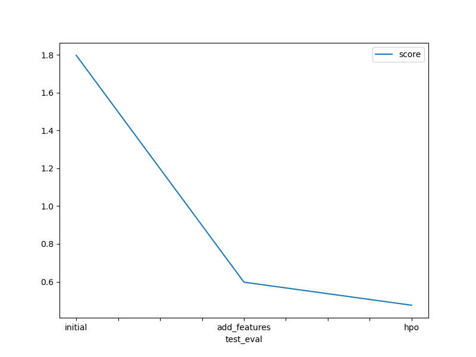

# Report: Predict Bike Sharing Demand with AutoGluon Solution
#### DIVYA M S

## Initial Training
### What did you realize when you tried to submit your predictions? What changes were needed to the output of the predictor to submit your results?
Format of the csv file has to be same as that is suggested by Kaggle.
There shall not be any negative values in the results submitted. Negative values (if any) are to be set to zero.

### What was the top ranked model that performed?
Top ranked trained model in Initial Training was WeightedEnsemble_L3, which obtained a public score of 1.79796 in the Kaggle competition.

## Exploratory data analysis and feature creation
### What did the exploratory analysis find and how did you add additional features?
As per Exploratory Data Analysis, it was identified that the data has some category features, such as datetime, which could be separated for better training.
So datetime feature is separated into 4 numerical features viz. year, month, day and hour utlizing Pandas datetime functions.

### How much better did your model preform after adding additional features and why do you think that is?
Before introducing additional features, model performance was only -53.211 and Kaggle score was 1.79796.
After introducing additional features, model performance improved to -30.417 and Kaggle score improved to 0.59782.

## Hyper parameter tuning
### How much better did your model preform after trying different hyper parameters?
After hyper parameter tuning, Kaggle score improved from 0.59782 to 0.47574.
However, model performance has reduced from -30.4174 to -36.4749.

### If you were given more time with this dataset, where do you think you would spend more time?
Further analysis of features could be done to select the optimal ones and to remove the irrelevant features for training the predictor.

### Create a table with the models you ran, the hyperparameters modified, and the kaggle score.
|model|learning_rate|activation|num_boost_round|score|
|--|--|--|--|--|
|initial|default|default|default|1.79796|
|add_features|default|default|default|0.59782|
|hpo|0.0005|relu|100|0.47574|

### Create a line plot showing the top model score for the three (or more) training runs during the project.

### Create a line plot showing the top kaggle score for the three (or more) prediction submissions during the project.

## Summary
Developed a machine learning model that predicts Bike Sharing Demand using historical data from Kaggle, AutoGluon library and AWS Sagemaker. With AutoGluon library, exploratory data analysis was done. Additionally hyperparameter optimization was attempted to improve the performance of model. Three iterations of model training was done: Initially with the raw feature set, then with additional features and afterwards with hyperparameter optimization. After, the third iteration, model achieved public score of 0.47574 in the Kaggle competition.